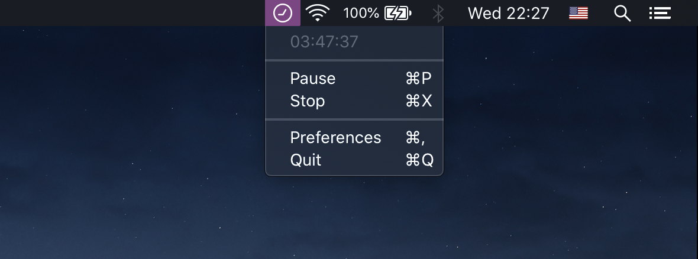

  
  <h1>MenuBarTimer</h1>
  
Minimalist timer running on the menu bar

Track your time with a simple unintrusive macOS menu bar app. Save your logs and keep track of your schedules.

### Features
- Stopwatch
- Save logged times to a csv
- Select file location

### Screenshots

### Coming features
- Toggle save file
- Customizable timer

## License
Released under [MIT License](https://github.com/grdnrt/menu-bar-timer/blob/master/LICENSE)
